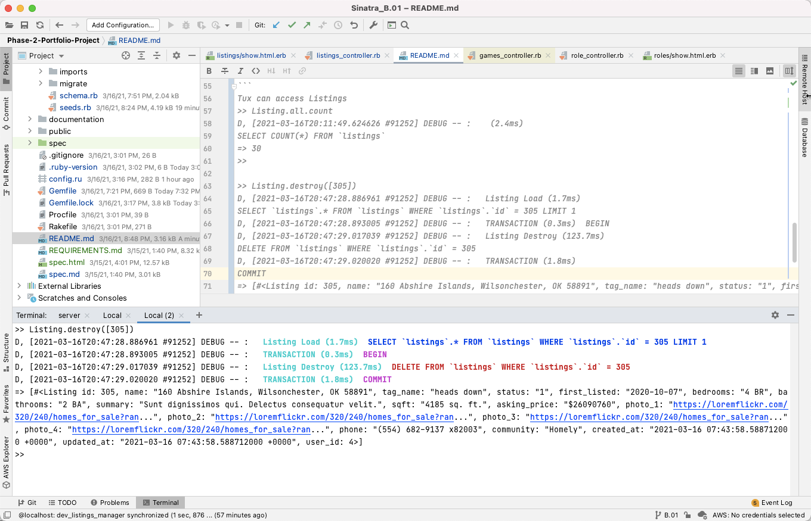

# Sinatra-MySQL Resource Manager

## Flatiron School Phase 2 Requirement

### Overview

This Resource Manager domain composed of 3 main models, Listing, User, and Genre. The models will relate to each other
and collaborate heavily. Additionally, you're going to be extracting some common functionality out of those models and
into a module, Concerns::Findable, which you'll then mix back into the models.
*****

### See Documentation

Google
Doc: https://docs.google.com/document/d/e/2PACX-1vR_jpC1g9arR_SajVFdnWFn5kpAgFiWd-aGGWUPvTjFyJyJv6v1Z6zPunRnU7W0HLGSR193bvL-pDSz/pub
*****

1. Setup project structure

- [x] Use Corneal to setup baseline structure
- [x] Manually added documentation and links
- [x] Manually added custom theme based on Materialize Theme and BootStrap Template
- [x] Validate installation with shotgun
- [x] Github Init/Commit

2. Setup Project MVC: Listings The listing manager uses I need to generate a demo list of properties with the Faker gem.
   There are a couple challenges here:
    - Generating images
    - Generating listings based on my local

      #### Documentation:
      https://github.com/faker-ruby/faker/blob/master/lib/locales/README.md
      https://github.com/faker-ruby/faker#customization
      

    Add requirements for listings migration/seed
    - [x] Created DB dev_sinatra_resource manager
    - [x] Create table Listings
    - [x] Added listings MVC
    - [x] Added Listings Seeds
    - [x] Verify database/objects appear in database

3. Tux: Validating Listings CRUD
```
Tux can access the database
% tux
Resolving dependencies...
D, [2021-03-16T20:07:03.027054 #89910] DEBUG -- :    (0.4ms)  
SELECT `schema_migrations`.`version` FROM `schema_migrations` 
ORDER BY `schema_migrations`.`version` ASC
Loading development environment (Rack 1.3)
>> 
```

```
Tux can access Listings
>> Listing.all.count
D, [2021-03-16T20:11:49.624626 #91252] DEBUG -- :    (2.4ms)  
SELECT COUNT(*) FROM `listings`
=> 30
>> 

>> Listing.destroy([305])
D, [2021-03-16T20:47:28.886961 #91252] DEBUG -- :   Listing Load (1.7ms)  
SELECT `listings`.* FROM `listings` WHERE `listings`.`id` = 305 LIMIT 1
D, [2021-03-16T20:47:28.893005 #91252] DEBUG -- :   TRANSACTION (0.3ms)  BEGIN
D, [2021-03-16T20:47:29.017039 #91252] DEBUG -- :   Listing Destroy (123.7ms)  
DELETE FROM `listings` WHERE `listings`.`id` = 305
D, [2021-03-16T20:47:29.020020 #91252] DEBUG -- :   TRANSACTION (1.8ms)  
COMMIT
=> [#<Listing id: 305, name: "160 Abshire Islands, Wilsonchester, OK 58891", tag_name: "heads down", status: "1", first_listed: "2020-10-07", bedrooms: "4 BR", bathrooms: "2 BA", summary: "Sunt dignissimos qui. Delectus consequatur velit.", sqft: "4185 sq. ft.", asking_price: "$26090760", photo_1: "https://loremflickr.com/320/240/homes_for_sale?ran...", photo_2: "https://loremflickr.com/320/240/homes_for_sale?ran...", photo_3: "https://loremflickr.com/320/240/homes_for_sale?ran...", photo_4: "https://loremflickr.com/320/240/homes_for_sale?ran...", phone: "(554) 682-9137 x82003", community: "Homely", created_at: "2021-03-16 07:43:58.588712000 +0000", updated_at: "2021-03-16 07:43:58.588712000 +0000", user_id: 4>]
>> 
```
### RubyMine IDE with Terminal



